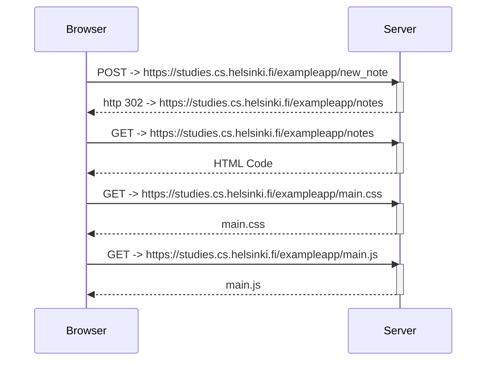

# Sequence Diagram POST in Traditional APP

```mermaid
sequenceDiagram
    participant Browser
    participant Server

    Browser->>Server: POST -> https://studies.cs.helsinki.fi/exampleapp/new_note
    
    activate Server
    Server-->>Browser: http 302 -> https://studies.cs.helsinki.fi/exampleapp/notes
    deactivate Server

    Browser->>Server: GET -> https://studies.cs.helsinki.fi/exampleapp/notes
    
    activate Server
    Server-->>Browser: HTML Code
    deactivate Server

    Browser->>Server: GET -> https://studies.cs.helsinki.fi/exampleapp/main.css
    
    activate Server
    Server-->>Browser: main.css
    deactivate Server

    Browser->>Server: GET -> https://studies.cs.helsinki.fi/exampleapp/main.js
    
    activate Server
    Server-->>Browser: main.js
    deactivate Server
    
```
